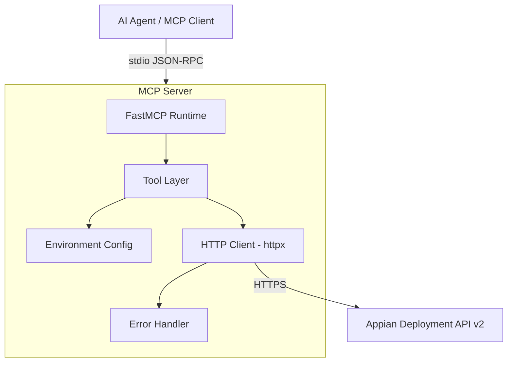

# Design Document: Appian Deployment MCP Server

## Overview

This document describes the technical design for a Python-based MCP (Model Context Protocol) server that wraps the Appian Deployment REST API v2. The server exposes each Appian deployment API endpoint as an MCP tool, enabling AI agents to perform conversational CI/CD workflows — exporting, inspecting, deploying, and monitoring Appian application packages.

The server uses the `mcp` Python SDK (FastMCP) with stdio transport, is distributed via `uvx`/`pip`, and supports multi-environment configuration through environment variables. All API communication is async using `httpx`.

### Key Design Decisions

1. **FastMCP over raw MCP SDK**: FastMCP provides a decorator-based API (`@mcp.tool`) that auto-generates tool schemas from Python type hints and docstrings, reducing boilerplate.
2. **httpx for HTTP**: `httpx` is chosen over `aiohttp` because it provides a cleaner async API, native `multipart/form-data` support, and is the de facto standard for async HTTP in modern Python.
3. **Environment variable configuration**: No config files — all settings come from environment variables, making the server easy to configure in CI/CD pipelines and MCP client configs (e.g., `mcp.json`).
4. **Thin wrapper philosophy**: Each MCP tool maps directly to one Appian API endpoint. The server does not add business logic beyond parameter validation, error mapping, and async polling.

## Architecture



### Layered Architecture

The server is organized into four layers:

1. **MCP Layer** (`server.py`): FastMCP instance, tool registration, stdio transport entry point.
2. **Tool Layer** (`tools/`): One module per tool group. Each tool function validates inputs, delegates to the API client, and formats responses.
3. **Client Layer** (`client.py`): A single `AppianClient` class that wraps `httpx.AsyncClient` with auth headers, base URL construction, multipart upload helpers, and file download.
4. **Config Layer** (`config.py`): Reads environment variables, builds `EnvironmentConfig` objects, selects the active environment per request.

### Data Flow

1. Agent sends a tool call via stdio (JSON-RPC).
2. FastMCP deserializes the call, routes to the decorated tool function.
3. Tool function resolves the target environment, validates parameters.
4. Tool function calls `AppianClient` methods.
5. `AppianClient` sends HTTP request to Appian API, handles errors.
6. Tool function formats the response and returns it to FastMCP.
7. FastMCP serializes the response back over stdio.

## Components and Interfaces

### 1. Entry Point (`server.py`)

```python
from mcp.server.fastmcp import FastMCP

mcp = FastMCP(
    name="appian-deployment",
    instructions="Appian Deployment REST API v2 — export, inspect, deploy, and monitor Appian packages."
)

# Tool modules register themselves against this mcp instance
from .tools import packages, exports, inspections, deployments, polling, downloads, environments

def main():
    mcp.run(transport="stdio")
```

### 2. Configuration (`config.py`)

Responsible for reading environment variables and constructing environment configs.

```python
@dataclass(frozen=True)
class EnvironmentConfig:
    name: str
    domain: str
    api_key: str | None
    oauth_token: str | None

    @property
    def base_url(self) -> str:
        return f"https://{self.domain}/suite/deployment-management/v2"

    @property
    def auth_headers(self) -> dict[str, str]:
        if self.api_key:
            return {"appian-api-key": self.api_key}
        return {"Authorization": f"Bearer {self.oauth_token}"}
```

**Environment discovery logic:**
- Read `APPIAN_DOMAIN` + `APPIAN_API_KEY` / `APPIAN_OAUTH_TOKEN` → default environment.
- Scan for `APPIAN_<ENV>_DOMAIN` patterns → named environments.
- API key takes precedence over OAuth token when both are set.

```python
def load_environments() -> dict[str, EnvironmentConfig]:
    """Load all environments from env vars. Returns dict keyed by env name."""
    ...

def resolve_environment(
    environments: dict[str, EnvironmentConfig],
    environment: str | None = None
) -> EnvironmentConfig:
    """Resolve the target environment. Falls back to 'default'."""
    ...
```

### 3. HTTP Client (`client.py`)

A thin async wrapper around `httpx.AsyncClient`.

```python
class AppianClient:
    def __init__(self, config: EnvironmentConfig):
        self._config = config
        self._client = httpx.AsyncClient(
            base_url=config.base_url,
            headers=config.auth_headers,
            timeout=httpx.Timeout(30.0, read=120.0),
        )

    async def get(self, path: str) -> dict:
        """GET request with error handling."""
        ...

    async def post_json(self, path: str, body: dict, headers: dict | None = None) -> dict:
        """POST JSON body with optional extra headers."""
        ...

    async def post_multipart(self, path: str, json_part: dict, files: dict[str, tuple]) -> dict:
        """POST multipart/form-data with JSON metadata and file parts."""
        ...

    async def download_file(self, url: str, save_path: Path) -> Path:
        """Download a file from a URL and save to disk."""
        ...

    async def get_text(self, path: str) -> str:
        """GET request returning plain text response."""
        ...

    async def close(self):
        await self._client.aclose()
```

### 4. Tool Modules (`tools/`)

Each module registers tools against the shared `mcp` instance.

#### `tools/environments.py`
| Tool | Parameters | Description |
|------|-----------|-------------|
| `list_environments` | — | Returns names of all configured environments |

#### `tools/packages.py`
| Tool | Parameters | Description |
|------|-----------|-------------|
| `get_application_packages` | `application_uuid: str`, `environment?: str` | GET `/applications/<uuid>/packages` |

#### `tools/exports.py`
| Tool | Parameters | Description |
|------|-----------|-------------|
| `export_package` | `uuids: list[str]`, `export_type: str`, `name?: str`, `description?: str`, `environment?: str` | POST `/deployments` with `Action-Type: export` |

#### `tools/inspections.py`
| Tool | Parameters | Description |
|------|-----------|-------------|
| `inspect_package` | `package_file_path: str`, `customization_file_path?: str`, `admin_console_settings_file_path?: str`, `environment?: str` | POST `/inspections` multipart |
| `get_inspection_results` | `inspection_uuid: str`, `environment?: str` | GET `/inspections/<uuid>` |

#### `tools/deployments.py`
| Tool | Parameters | Description |
|------|-----------|-------------|
| `deploy_package` | `name: str`, `package_file_path?: str`, `customization_file_path?: str`, `admin_console_settings_file_path?: str`, `plugins_file_path?: str`, `data_source?: str`, `database_scripts?: list[dict]`, `description?: str`, `environment?: str` | POST `/deployments` with `Action-Type: import` multipart |
| `get_deployment_results` | `deployment_uuid: str`, `environment?: str` | GET `/deployments/<uuid>` |
| `get_deployment_log` | `deployment_uuid: str`, `environment?: str` | GET `/deployments/<uuid>/log` |

#### `tools/polling.py`
| Tool | Parameters | Description |
|------|-----------|-------------|
| `poll_deployment_status` | `deployment_uuid: str`, `poll_interval_seconds?: int`, `max_wait_seconds?: int`, `environment?: str` | Polls GET `/deployments/<uuid>` until terminal |
| `poll_inspection_status` | `inspection_uuid: str`, `poll_interval_seconds?: int`, `max_wait_seconds?: int`, `environment?: str` | Polls GET `/inspections/<uuid>` until terminal |

#### `tools/downloads.py`
| Tool | Parameters | Description |
|------|-----------|-------------|
| `download_exported_package` | `deployment_uuid: str`, `save_directory?: str`, `environment?: str` | Downloads the exported .zip to local disk |

### 5. Error Handler (`errors.py`)

Maps HTTP status codes and network errors to structured error responses.

```python
class AppianAPIError(Exception):
    def __init__(self, status_code: int, message: str):
        self.status_code = status_code
        self.message = message

def handle_response(response: httpx.Response) -> dict:
    """Raise AppianAPIError for non-2xx responses with mapped messages."""
    ...

ERROR_MESSAGES = {
    401: "Invalid or expired authentication credentials. Check your APPIAN_API_KEY or APPIAN_OAUTH_TOKEN.",
    403: "Insufficient permissions for the requested operation. Verify the service account has the required role.",
    404: "The requested resource was not found. Verify the UUID is correct.",
    409: "Concurrency limit reached. Retry the operation after a short delay.",
}
```

## Data Models

### EnvironmentConfig

| Field | Type | Description |
|-------|------|-------------|
| `name` | `str` | Environment name (e.g., "default", "dev", "prod") |
| `domain` | `str` | Appian domain (e.g., "mysite.appiancloud.com") |
| `api_key` | `str \| None` | API key for authentication |
| `oauth_token` | `str \| None` | OAuth 2.0 bearer token |

### Tool Response Models

Tool functions return plain `dict` or `str` values — FastMCP handles serialization. The response shapes mirror the Appian API responses with the following conventions:

**Export/Deploy initiation response:**
```python
{"uuid": str, "url": str, "status": str}
```

**Inspection initiation response:**
```python
{"uuid": str, "url": str}
```

**Deployment results (import):**
```python
{
    "status": str,
    "summary": {
        "objects": {"total": int, "imported": int, "failed": int, "skipped": int},
        "plugins": {"total": int, "imported": int, "skipped": int},
        "adminConsoleSettings": {"total": int, "imported": int, "failed": int, "skipped": int},
        "databaseScripts": int,
    },
    "deploymentLogUrl": str,
}
```

**Deployment results (export):**
```python
{
    "status": str,
    "packageZip": str,
    "dataSource": str | None,
    "databaseScripts": list[{"fileName": str, "orderId": str, "url": str}],
    "pluginsZip": str | None,
    "customizationFile": str | None,
    "customizationFileTemplate": str | None,
    "deploymentLogUrl": str,
}
```

**Inspection results:**
```python
{
    "status": str,
    "summary": {
        "objectsExpected": {"total": int, "imported": int, "failed": int, "skipped": int},
        "problems": {
            "totalErrors": int,
            "totalWarnings": int,
            "errors": list[{"errorMessage": str, "objectName": str, "objectUuid": str}],
            "warnings": list[{"warningMessage": str, "objectName": str, "objectUuid": str}],
        },
    },
}
```

**Polling response (adds wrapper):**
```python
{
    "completed": bool,
    "timed_out": bool,
    "elapsed_seconds": float,
    "result": dict,  # Full deployment or inspection result
}
```

**Download response:**
```python
{"file_path": str, "file_size_bytes": int}
```

**Error response:**
```python
{"error": True, "status_code": int, "message": str}
```

### Terminal Status Sets

```python
DEPLOYMENT_TERMINAL_STATUSES = {
    "COMPLETED",
    "COMPLETED_WITH_ERRORS",
    "COMPLETED_WITH_IMPORT_ERRORS",
    "COMPLETED_WITH_PUBLISH_ERRORS",
    "COMPLETED_WITH_EXPORT_ERRORS",
    "FAILED",
    "PENDING_REVIEW",
    "REJECTED",
}

INSPECTION_TERMINAL_STATUSES = {"COMPLETED", "FAILED"}
```


## Correctness Properties

*A property is a characteristic or behavior that should hold true across all valid executions of a system — essentially, a formal statement about what the system should do. Properties serve as the bridge between human-readable specifications and machine-verifiable correctness guarantees.*

### Property 1: Base URL construction

*For any* valid domain string, the `EnvironmentConfig.base_url` property SHALL produce `https://{domain}/suite/deployment-management/v2`.

**Validates: Requirements 1.6**

### Property 2: Environment discovery from env var patterns

*For any* set of environment variables matching the pattern `APPIAN_<ENV>_DOMAIN` paired with `APPIAN_<ENV>_API_KEY` or `APPIAN_<ENV>_OAUTH_TOKEN`, `load_environments()` SHALL return an `EnvironmentConfig` for each matched pair with the correct name, domain, and credentials.

**Validates: Requirements 2.1**

### Property 3: Environment resolution by name

*For any* dict of `EnvironmentConfig` objects and any key that exists in that dict, `resolve_environment(envs, key)` SHALL return the config whose name matches that key.

**Validates: Requirements 2.2**

### Property 4: API path construction

*For any* UUID string and any endpoint type (packages, inspections, deployments, deployment log), the constructed request path SHALL match the documented pattern: `/applications/{uuid}/packages`, `/inspections/{uuid}`, `/deployments/{uuid}`, or `/deployments/{uuid}/log` respectively.

**Validates: Requirements 3.2, 6.2, 8.2, 9.2**

### Property 5: API response field preservation

*For any* valid Appian API response dict containing the documented fields for a given endpoint, the tool's response SHALL preserve all specified fields with their original values.

**Validates: Requirements 3.3, 4.3, 5.4, 6.3, 7.5, 8.3, 8.4**

### Property 6: HTTP error status mapping

*For any* HTTP error status code in the known set {401, 403, 404, 409}, the error handler SHALL return an error response containing that status code and the corresponding human-readable message. *For any* HTTP error status code not in the known set, the error handler SHALL return the raw status code and response body.

**Validates: Requirements 3.4, 4.4, 6.5, 8.6, 9.4, 12.1, 12.2, 12.3, 12.4, 12.6**

### Property 7: Export request construction

*For any* valid set of export parameters (uuids, export_type, optional name and description), the constructed POST request to `/deployments` SHALL include the `Action-Type: export` header and a JSON body containing all provided parameters.

**Validates: Requirements 4.2**

### Property 8: File path validation error identifies the path

*For any* file path string that does not exist on disk, the file validation logic SHALL return an error message that contains the non-existent path string.

**Validates: Requirements 5.5, 7.6**

### Property 9: Deploy artifact validation

*For any* invocation of `deploy_package` where `package_file_path`, `admin_console_settings_file_path`, `plugins_file_path`, and the combination of `data_source` + `database_scripts` are all absent, the tool SHALL return an error indicating at least one deployable artifact is required.

**Validates: Requirements 7.4**

### Property 10: Polling terminates at terminal status

*For any* sequence of API responses where the final response has a status in the terminal set, the polling function SHALL stop polling and return the terminal response. The number of API calls SHALL equal the position of the first terminal status in the sequence.

**Validates: Requirements 10.2, 10.6**

### Property 11: Polling timeout returns last status

*For any* polling invocation where all API responses have status `IN_PROGRESS` and the elapsed time exceeds `max_wait_seconds`, the polling function SHALL return a response with `timed_out: true` and the last known status.

**Validates: Requirements 10.4, 10.8**

### Property 12: Network error includes domain

*For any* `EnvironmentConfig` with a given domain, when a network connection error occurs, the error message SHALL contain that domain string.

**Validates: Requirements 12.5**

### Property 13: All tools have complete metadata

*For any* tool registered with the MCP server, the tool SHALL have a non-empty name, a non-empty description, and a typed input schema with at least one parameter defined.

**Validates: Requirements 13.3**

## Error Handling

### HTTP Error Mapping

The `handle_response()` function in `errors.py` maps Appian API HTTP errors to user-friendly messages:

| HTTP Status | Error Message |
|-------------|--------------|
| 401 | Invalid or expired authentication credentials. Check your APPIAN_API_KEY or APPIAN_OAUTH_TOKEN. |
| 403 | Insufficient permissions for the requested operation. Verify the service account has the required role. |
| 404 | The requested resource was not found. Verify the UUID is correct. |
| 409 | Concurrency limit reached. Retry the operation after a short delay. |
| Other 4xx/5xx | Returns raw status code and response body. |

### Network Errors

`httpx.ConnectError` and `httpx.TimeoutException` are caught and converted to structured error responses that include the target domain name for diagnosis.

### File Validation Errors

Before any multipart upload, the tool validates that all specified file paths exist and are readable. Missing files produce an error naming the specific path, without making any API call.

### Input Validation Errors

- `deploy_package` validates that at least one deployable artifact is provided before making the API call.
- `export_package` validates that `export_type` is either `"package"` or `"application"`.
- UUID parameters are validated as non-empty strings.

### Error Response Format

All errors are returned as structured dicts rather than raising exceptions, so the agent receives actionable information:

```python
{"error": True, "status_code": 401, "message": "Invalid or expired authentication credentials..."}
```

For file/validation errors (no HTTP call made):

```python
{"error": True, "message": "File not found: /path/to/missing.zip"}
```

## Testing Strategy

### Unit Tests

Unit tests cover specific examples, edge cases, and integration points:

- **Config loading**: Verify default env var reading, OAuth fallback, missing credentials error, missing domain error.
- **Environment resolution**: Verify named environment lookup, default fallback, unknown environment error.
- **File validation**: Verify existing files pass, missing files produce errors with the path.
- **Deploy artifact validation**: Verify at least one artifact is required.
- **Response parsing**: Verify specific API response examples are correctly parsed for each endpoint.
- **Polling**: Verify IN_PROGRESS → COMPLETED sequence, timeout behavior, default parameter values.
- **Download**: Verify two-step flow (get results → download file), non-export UUID error.

### Property-Based Tests

Property-based tests verify universal properties across generated inputs using [Hypothesis](https://hypothesis.readthedocs.io/). Each property test runs a minimum of 100 iterations.

| Property | Test Description | Tag |
|----------|-----------------|-----|
| 1 | Generate random domain strings, verify base URL format | Feature: appian-deployment-mcp, Property 1: Base URL construction |
| 2 | Generate random env var sets, verify environment discovery | Feature: appian-deployment-mcp, Property 2: Environment discovery |
| 3 | Generate random env config dicts, verify resolution by name | Feature: appian-deployment-mcp, Property 3: Environment resolution |
| 4 | Generate random UUIDs × endpoint types, verify path patterns | Feature: appian-deployment-mcp, Property 4: API path construction |
| 5 | Generate random valid API response dicts, verify field preservation | Feature: appian-deployment-mcp, Property 5: Response field preservation |
| 6 | Generate random HTTP error codes, verify mapped messages | Feature: appian-deployment-mcp, Property 6: HTTP error mapping |
| 7 | Generate random export params, verify request header and body | Feature: appian-deployment-mcp, Property 7: Export request construction |
| 8 | Generate random non-existent paths, verify error contains path | Feature: appian-deployment-mcp, Property 8: File path validation |
| 9 | Generate random empty artifact combos, verify error returned | Feature: appian-deployment-mcp, Property 9: Deploy artifact validation |
| 10 | Generate random status sequences ending in terminal, verify polling stops | Feature: appian-deployment-mcp, Property 10: Polling termination |
| 11 | Generate all-IN_PROGRESS sequences with short timeout, verify timeout response | Feature: appian-deployment-mcp, Property 11: Polling timeout |
| 12 | Generate random domains, simulate connection error, verify domain in message | Feature: appian-deployment-mcp, Property 12: Network error domain |
| 13 | Enumerate all registered tools, verify metadata completeness | Feature: appian-deployment-mcp, Property 13: Tool metadata |

### Integration Tests

Integration tests use mocked `httpx` responses to verify end-to-end tool behavior:

- **Multipart uploads**: Verify `inspect_package` and `deploy_package` construct correct multipart requests with file parts.
- **Polling loop**: Verify the full polling cycle with mocked sequential responses.
- **Download flow**: Verify `download_exported_package` chains the get-results and download calls correctly.
- **Auth header injection**: Verify API key and OAuth token are sent in the correct headers.

### Test Configuration

- **Framework**: pytest
- **PBT Library**: Hypothesis (minimum 100 examples per property via `@settings(max_examples=100)`)
- **HTTP Mocking**: `respx` (httpx-native mock library) or `pytest-httpx`
- **Async Testing**: `pytest-asyncio`
